# Flash Agent — Functioning Document

A no-code, behavioural specification of how the Flash Agent works end-to-end.
Source code references are intentionally omitted; this document describes the
**functioning** — what happens, when it happens, why it happens, and what it
produces.

> All diagrams in this document use **Mermaid**. They render natively on
> GitHub, GitLab, in VS Code (with the Markdown Preview Mermaid Support
> extension), and most modern markdown viewers.

---

## 1. Purpose

Flash Agent is a lightweight ITOps automation engine that continuously assesses
the health of a Kubernetes environment by combining LLM reasoning with
Model-Context-Protocol (MCP) tool servers.

It is built around Microsoft Research's **FLASH** (Feedback-guided Agentic
Workflow) methodology: scan → reflect → improve. Every scan produces a
structured health analysis; if problems persist across scans, the agent
generates *hindsight* that informs the next scan, so it gets smarter the
longer it runs.

Typical use cases:

- **Periodic cluster scan** (Kubernetes CronJob): one-shot scan, exit clean.
- **Continuous health monitor**: lightweight polling that only wakes the LLM
  when something changes.
- **Incident triage**: classify failure traces, propose remediation.
- **Progressive learning**: hindsight accumulates across iterations, sharpening
  the agent's diagnostic instincts.

---

## 2. Architecture (Conceptual)

Flash Agent is composed of five conceptual layers; nothing else.

| Layer | Responsibility |
|---|---|
| **Orchestration** | Picks a mode (scan or watch), runs the iteration loop, handles signals, returns analysis. |
| **MCP** | Talks to one or more MCP servers over JSON-RPC 2.0 (HTTP + SSE). Discovers tools, executes tool calls, surfaces results. |
| **Scope Discovery** | Determines what each MCP server is *authorised* to read (namespace, multi-namespace, cluster, agnostic, unknown). Merges scopes across servers. |
| **LLM** | Drives the ReAct (Reason-Act) reasoning loop. Plans tool calls, interprets results, produces final structured analysis. Also runs hindsight reflection as a separate LLM call. |
| **History & Reflection** | Bounded conversation memory across scans. Triggers hindsight when warning patterns recur. Trims to a token budget. |

External dependencies:

- An **OpenAI-compatible LLM endpoint** (OpenAI or Azure OpenAI).
- One or more **MCP servers** exposing Kubernetes-aware tools (pods, events,
  deployments, metrics, etc.).

The agent itself is stateless on disk — all memory is in-process and lasts only
for the lifetime of the process.

### 2.1 Component Diagram

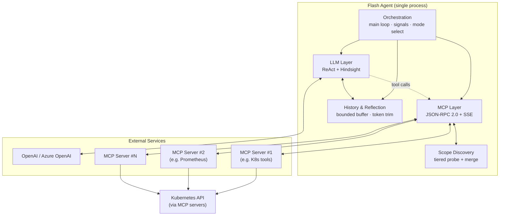

### 2.2 Conversation Topology

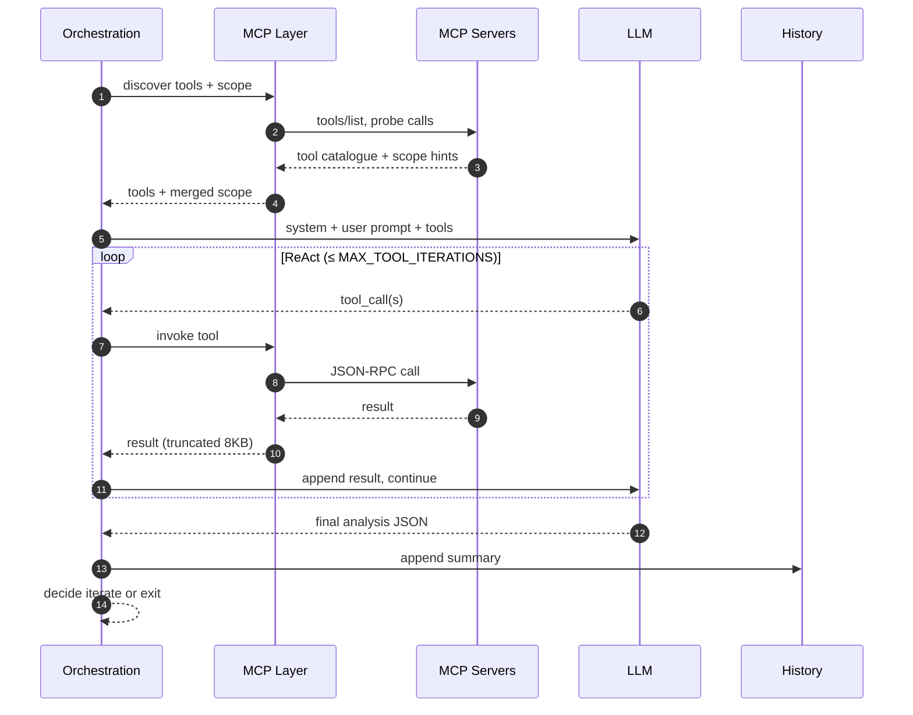

---

## 3. Operating Modes

Mode is chosen once at startup via the `WATCH_MODE` environment variable.

### 3.0 Mode Selection at Startup

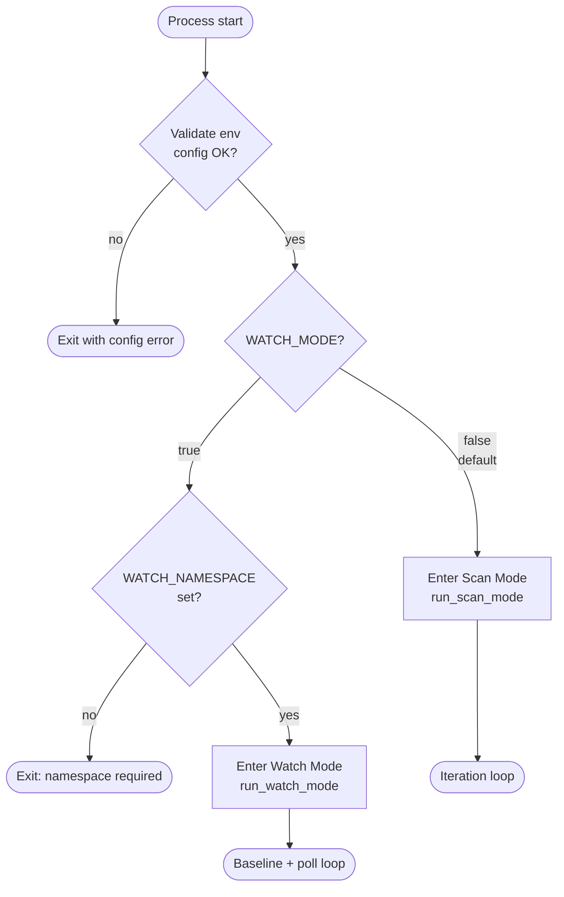

### 3.1 Scan Mode (default)

LLM-heavy; one full reasoning cycle per iteration.

- Runs the complete ReAct loop on every iteration.
- Between iterations, waits `RESCAN_DELAY` seconds (default 30).
- **Exits early** the moment no critical or warning issues remain.
- Otherwise continues for up to `MAX_ITERATIONS` iterations (default 10).

Best for: scheduled jobs, manual triage, situations where each scan should
produce a fresh, complete picture.

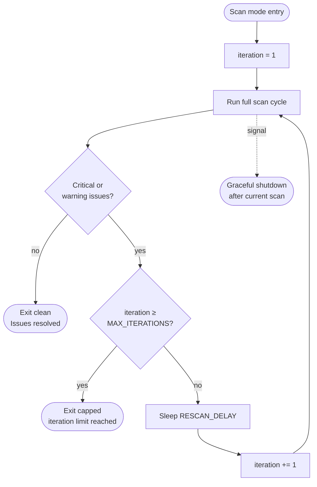

### 3.2 Watch Mode

LLM-light; the LLM is consulted only at startup and on anomalies.

- Requires `WATCH_NAMESPACE`.
- **Phase 1 (baseline):** the LLM picks a minimal set of polling tools and
  defines healthy thresholds (max pending pods, max failed pods, max restart
  delta, min pod count).
- **Phase 2 (polling):** the agent runs the chosen tools every
  `WATCH_INTERVAL` seconds (default 5) **without invoking the LLM**, hashing
  raw output for change detection.
- When a metric breaches a threshold, the agent escalates by triggering a full
  scan (or invoking an `on_change` callback if provided).

Best for: always-on monitoring where LLM cost matters; the LLM is paid for
*deviations*, not heartbeats.

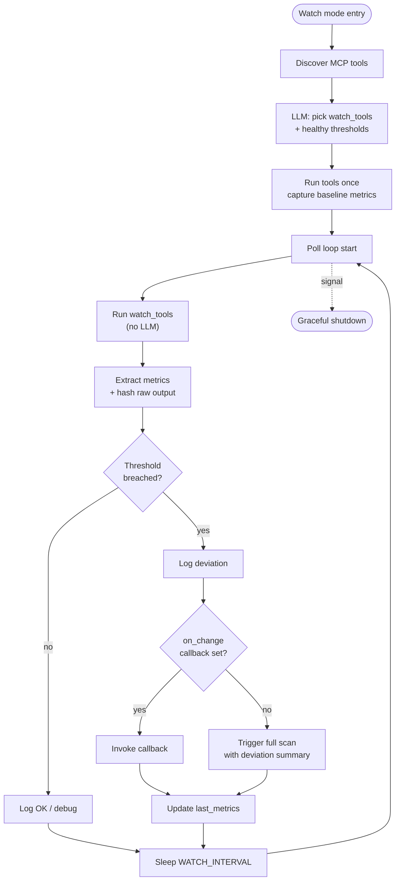

---

## 4. Scan Lifecycle (Step-by-Step)

A single scan iteration proceeds through these stages, in order.

### Stage 1 — Query Recording
The user-supplied scan query (`SCAN_QUERY`) is stamped with a `scan_id`
(timestamp + agent name) and added to execution history.

### Stage 2 — MCP Tool Discovery
For every URL in `MCP_URLS`:

1. Initialise a JSON-RPC session with the MCP server.
2. Call `tools/list` to fetch every tool's name, description, and input schema.
3. Discover the server's authorisation scope (see Stage 3).

The combined tool catalogue is what the LLM will see.

### Stage 3 — Scope Discovery & Merging

Per MCP server, scope is discovered using a tiered strategy:

1. **Explicit override.** If `AGENT_SCOPE_NAMESPACE` is set, use it; skip the
   rest.
2. **Schema check.** If no tool accepts a `namespace` parameter, classify as
   *agnostic* (e.g. Prometheus).
3. **Tier 1 — Introspection.** Call any tool matching
   `configuration|context|whoami|server_info|config_view|identity` and parse
   the namespace from its response.
4. **Tier 2 — Probe.** Call a low-risk tool (`pods`, `events`, `deployments`,
   `services`) with no arguments.
   - Success ⇒ **cluster** scope.
   - Forbidden ⇒ extract the service-account namespace from the error
     (`system:serviceaccount:<ns>:<sa>`).
5. **Tier 3 — Validate.** For each candidate namespace, call a
   namespace-required tool. Keep only those that succeed.

Scopes returned: `namespace`, `namespaces`, `cluster`, `agnostic`, `unknown`.

**Merging rules** (when several MCP servers are configured):

- Drop *agnostic* — they impose no constraint.
- If only *unknown* remains ⇒ unknown.
- If any namespace-scoped server exists ⇒ union of namespaces (least-privilege wins).
- Otherwise ⇒ cluster.

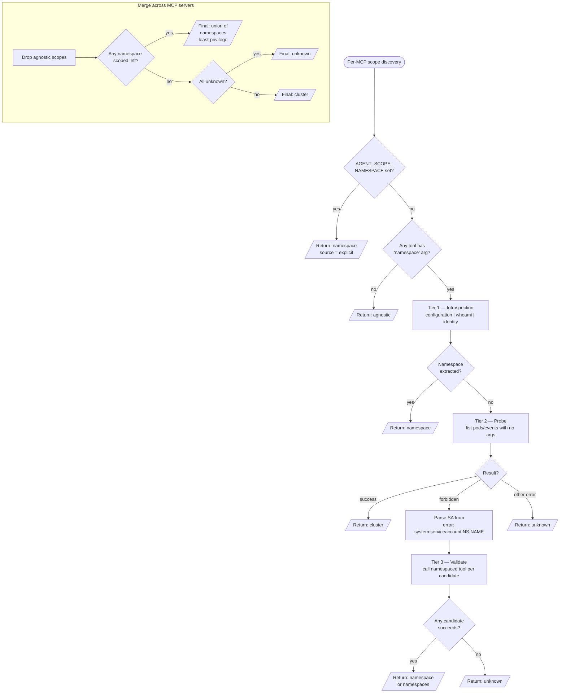

### Stage 4 — System Prompt Construction

A scope-aware system prompt is assembled from these blocks:

| Block | Function |
|---|---|
| **Role head** | Defines the agent as an ITOps reasoning engine that uses MCP tools. |
| **Scope block** | Encodes the merged scope as constraints on tool *shapes*, not tool names — so prompts stay portable across MCP implementations. |
| **Fallback doctrine** | Tells the LLM to read tool schemas, never assume tool names, and to retry with alternative tools on failure. |
| **Resource-metrics path** | Primary route (snapshot tools) and fallback route (PromQL timeseries) for CPU / memory / restart metrics. |
| **Chaos awareness** | How to detect anomalous pod fleets, suspicious events, metric-backed disturbances. |
| **Dependency drill-down** | How to trace cross-service log evidence and connection failures. |
| **Output schema** | Strict JSON contract the LLM must emit. |

If hindsight from prior iterations exists, it is appended to the user prompt.

### Stage 5 — ReAct Loop (≤ `MAX_TOOL_ITERATIONS`, default 10)

Each iteration:

1. Send conversation + tool catalogue to the LLM.
2. If the response contains tool calls:
   - Execute each tool through the appropriate MCP client (round-robin across
     clients until one succeeds).
   - Truncate each tool result to 8 000 characters to bound context.
   - Append the result to the conversation; loop again.
3. If the response contains content but no tool calls:
   - Try to parse it as the final JSON analysis.
   - If parsing fails, ask the LLM once more to reformat as JSON.
   - On second failure, abandon and surface a parse error.

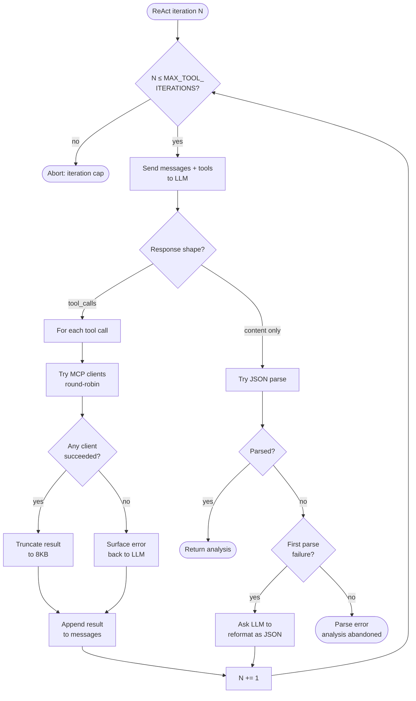

### Stage 6 — Result Logging
Health score, issue counts by severity, list of tools called, and iteration
count are written to logs.

### Stage 7 — History Update
The analysis is summarised (health, top issues) and added to the bounded
execution history. History is trimmed to `MAX_HISTORY_SIZE` (20 entries).

### Stage 8 — Hindsight Check
If two or more of the last three history entries contain warning keywords
(`error`, `failed`, `warning`, `critical`, `timeout`), or the heuristic
`should_generate_hindsight()` fires (low health, critical issues, repeated
failures), a separate hindsight LLM call is made (temperature 0.3, ≤ 800
tokens). Output is attached as `analysis.hindsight_reflection`.

### Stage 9 — Metadata
A `_metadata` block is attached: `scan_id`, `duration_sec`, list of tool calls,
iteration count.

### Stage 10 — Iteration Decision
If any critical or warning issue remains and `MAX_ITERATIONS` is not exhausted,
sleep `RESCAN_DELAY` and start the next scan. Otherwise terminate cleanly.

---

## 5. Watch Lifecycle (Step-by-Step)

### Phase 1 — Baseline Establishment (one-time, LLM-driven)

1. Discover MCP tools (same as scan Stage 2).
2. Send the baseline prompt asking the LLM to choose:
   - `watch_tools` — minimal tool list with arguments to poll continuously.
   - `healthy_thresholds` — `min_pods`, `max_restart_delta`,
     `max_pending_pods`, `max_failed_pods`.
3. Run the chosen tools once to capture baseline metrics: pod count, running
   pods, pending pods, failed pods, total restarts, error events, and a 12-char
   MD5 hash of raw output.

### Phase 2 — Polling Loop (no LLM)

Every `WATCH_INTERVAL` seconds:

1. Run all watch tools with their pre-configured arguments.
2. Heuristically extract metrics from raw output (pod-status lines, event counts).
3. Hash the raw concatenated output for fast change detection.
4. Compare to baseline and previous poll:
   - `pod_count < min_pods` ⇒ deviation.
   - `total_restarts − previous_restarts > max_restart_delta` ⇒ deviation.
   - `pending_pods > max_pending_pods` ⇒ deviation.
   - `failed_pods > max_failed_pods` ⇒ deviation.
   - `error_events` increased since last poll ⇒ deviation.
5. On deviation: log it, invoke `on_change` callback (or trigger a full scan),
   then update the rolling "last metrics" baseline.
6. On no deviation: log OK at debug level.

Loop honours SIGTERM/SIGINT with 0.5 s polling granularity for graceful exit.

---

## 6. Hindsight & Reflection

Hindsight is **guidance**, not action. It never decides to do anything; it only
shapes the next scan's prompt.

**Triggers**

- ≥ 2 history entries with warning keywords in the last 3 entries, OR
- `should_generate_hindsight()` heuristic fires:
  - health score < 80, or
  - any critical issue, or
  - repeated failures of the same kind.

**Build process**

1. Summarise up to the last 5 history entries (each truncated to 500 chars).
2. Build a hindsight prompt with: history summary, current environment, failure
   context (MCP errors, pod issues, health score).
3. Call the LLM with `HINDSIGHT_PROMPT`, temperature 0.3, max 800 tokens.
4. The LLM returns: status assessment, identified issues, root-cause
   hypothesis, recommended next actions, lessons for future scans.

**Use**

- Stored as `analysis.hindsight_reflection` on the current scan.
- Appended to the **user prompt** of the next scan.
- Cached so identical warning patterns don't re-trigger generation.

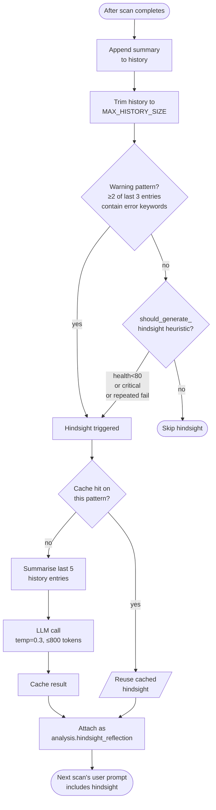

---

## 7. Memory Management

Flash Agent keeps a small **in-process memory** that persists across scan
iterations within a single process and is intentionally discarded on process
exit. Memory is *not* a recording of every tool call — it is a curated,
condensed trail of what each scan concluded, used to inform future scans via
hindsight.

### 7.1 What lives in memory

The agent holds a single bounded list, `self.history`, plus a couple of
helper variables:

| Store | Lifetime | Contents |
|---|---|---|
| `self.history` | Process lifetime, hard-capped at 20 entries (FIFO) | One *user* + one *assistant* entry per completed scan |
| `self._last_hindsight` | Process lifetime, only the latest value | Most recent hindsight reflection text |
| `self._scan_counter` | Process lifetime | Monotonic scan id source |
| Per-scan `messages` | **One scan only** — discarded at scan end | Full LLM conversation incl. raw tool calls and results |
| Watch mode `baseline` + `last_metrics` | Watch mode only — discarded when `watch()` returns | Selected tools, thresholds, rolling pod/restart deltas |

Each `self.history` entry has the shape:

| Field | Description |
|---|---|
| `role` | `user`, `assistant`, `tool`, or `system` — mirrors LLM message roles |
| `content` | Condensed summary text (≤ ~1500 chars) — never raw tool output |
| `metadata` | Optional: `scan_id`, `tools_called`, ad-hoc fields |

### 7.2 What gets appended after each scan

Exactly two entries are pushed per scan, in this order:

1. **User entry** — the scan query plus `metadata.scan_id`.
2. **Assistant entry** — a *summarised* analysis produced by
   `format_analysis_for_history()`. The summary contains:
   - Health score and pod totals.
   - Top 5 issues (severity, component, ≤ 100-char summary).
   - Experiment id if any.

The full analysis JSON, all raw tool outputs, and the per-scan `messages` list
are all **discarded** — only this summary survives. Each entry stays around
1.5 KB, so the full 20-entry history sits at roughly 30 KB.

### 7.3 Trimming policy (two layers)

| Layer | Where | Rule | Eviction |
|---|---|---|---|
| **Hard cap** | `_add_to_history()` after every append | `len(history) > MAX_HISTORY_SIZE (20)` ⇒ keep last 20 | FIFO — oldest dropped first |
| **Token budget** | `trim_history_to_token_limit()`, only when hindsight is generated | Estimate 4 chars/token; trim a *copy* to ≤ 50 000 tokens for the hindsight prompt | FIFO — never mutates `self.history` |

The hard entry-count cap is the active constraint in practice. The
token-budget trim is a defensive guard scoped to the hindsight call alone and
operates on a copy of history.

### 7.4 Conversation messages vs. execution history

These are separate data structures with different lifetimes:

- The `messages` list (system + user + tool calls + tool results) lives only
  for one scan. It is **rebuilt fresh** every scan from the system prompt,
  user query, and (if applicable) the latest hindsight text. The LLM never
  sees prior scans' conversation details.
- `self.history` carries forward only the *summarised conclusions*. Hindsight
  is the bridge: it reads history, produces a short reflection, and that
  reflection is the only memory injected into the next scan's user prompt.

This means the LLM solves each scan independently with only condensed,
abstracted lessons from before — never replaying the full prior reasoning
chain.

### 7.5 Persistence across process restarts

**None.** All memory is in-process. On exit, `self.history`,
`self._last_hindsight`, the watch baseline, and scan counters are all
released. A new process starts with empty memory; watch mode re-establishes
baseline by re-querying the LLM.

If durable cross-restart memory is ever required, it must be added externally
(persisting `self.history` to a store between scans). The current agent does
not write state to disk.

### 7.6 Hindsight cache (declared but unused)

`HindsightBuilder` declares a `self._hindsight_cache` dictionary but never
reads or writes it in the current code. Hindsight is regenerated each time
the warning-pattern check fires; the most recent reflection is held in
`self._last_hindsight` for debugging visibility, not for reuse. Treat the
cache field as a stub.

### 7.7 Memory Lifecycle Diagram

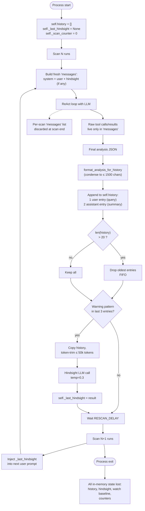

### 7.8 Memory at a Glance

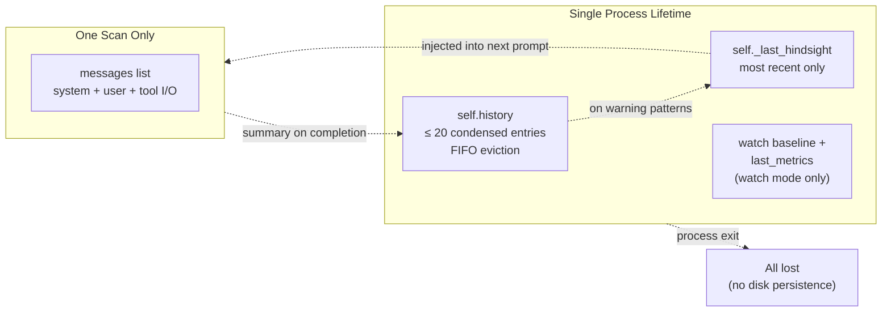

---

## 8. MCP Integration Details

**Transport.** JSON-RPC 2.0 over HTTP, with Server-Sent-Events parsing on responses.

**Tool catalogue.** Each tool advertises a name, description, and JSON-Schema
input contract. The agent translates these into OpenAI function-calling format
for the LLM.

**Calling convention.** When the LLM emits a tool call, the agent tries each
configured MCP client in order until one accepts the call. Failures are logged
and surfaced back to the LLM as tool errors so it can choose an alternative.

**Result handling.** Results are truncated to 8 000 characters to keep context
size bounded. Truncation is per-call, not cumulative.

---

## 9. LLM Integration Details

| Aspect | Behaviour |
|---|---|
| **Provider** | OpenAI or Azure OpenAI (auto-detected from `OPENAI_BASE_URL` containing `.openai.azure.com`). |
| **Model** | Configured via `MODEL_ALIAS` (required). |
| **Temperature** | 0.1 for analysis (deterministic), 0.3 for hindsight (mild creativity). |
| **Timeout** | 120 s per call. |
| **Token budget** | Estimated at 4 chars / token. History trims to a configurable limit (default 90 000 tokens for hindsight context, 50 000 for trimming). |
| **Conversation lifecycle** | Each scan starts with a *fresh* messages list (system + user). Tool calls and results are appended within the scan only. Cross-scan memory lives in execution history, not in messages. |
| **JSON parsing** | The agent extracts JSON from raw text *or* from fenced code blocks (```json … ```). On parse failure, it asks once for reformatting. |

---

## 10. Output: The Analysis Dictionary

Every scan returns a single dictionary with this shape (descriptive, not literal):

| Field | Description |
|---|---|
| `status_reasoning` | Why the agent reached its conclusion: determined status, justification list, data-quality assessment (completeness, gaps, confidence impact). |
| `thoughts` | Key observations, analysis approach, observability gaps. |
| `health` | Numeric snapshot: total / healthy / unhealthy pods, error & warning counts, overall health score 0-100 (–1 if analysis failed). |
| `issues` | Array of detected problems. Each item: `severity` (critical / warning / info), `component`, `category` (CrashLoop, OOM, ImagePull, Connectivity, …), `summary`, `recommended_action`. |
| `insights` | Narrative analysis: summary, concerns, recommendations, observability recommendations. |
| `_metadata` | `scan_id`, `duration_sec`, `tool_calls`, `iterations`. |
| `hindsight_reflection` | `{generated: bool, content: str | null}`. |

---

## 11. Configuration Reference

| Variable | Default | Purpose |
|---|---|---|
| `AGENT_NAME` | `flash-agent` | Identifier in logs and traces. |
| `OPENAI_BASE_URL` | *required* | LLM endpoint. |
| `OPENAI_API_KEY` | *required* | LLM credential. |
| `MODEL_ALIAS` | *required* | Model to use (e.g. `gpt-4`, a custom alias). |
| `AZURE_API_VERSION` | `2025-04-01-preview` | Used only for Azure endpoints. |
| `MCP_URLS` | *required* | Comma-separated list of MCP server URLs. |
| `MCP_TIMEOUT` | `30` | Per-call MCP timeout (seconds). |
| `SCAN_QUERY` | `Analyse the data from MCP tools and provide insights.` | Default user prompt. |
| `AGENT_SCOPE_NAMESPACE` | *empty* | Force a namespace; bypasses scope discovery. |
| `MAX_ITERATIONS` | `10` | Max scan iterations before exit. |
| `RESCAN_DELAY` | `30` | Seconds between iterations (scan mode). |
| `WATCH_MODE` | `false` | Enable watch mode. |
| `WATCH_NAMESPACE` | *empty* | Namespace to monitor (watch mode). |
| `WATCH_INTERVAL` | `5.0` | Poll interval (watch mode, seconds). |
| `MAX_TOOL_ITERATIONS` | `10` | Max ReAct iterations within a single scan. |
| `MAX_HISTORY_SIZE` | `20` | Bounded execution history length. |
| `LOG_LEVEL` | `INFO` | `DEBUG` / `INFO` / `WARNING` / `ERROR`. |

---

## 12. Termination Conditions

**Scan mode** terminates when any of:

- All issues resolved (only info-level remaining or none at all).
- `MAX_ITERATIONS` reached.
- Unhandled exception inside a scan.
- SIGTERM / SIGINT received (current iteration completes, then exits).

**Watch mode** terminates when:

- SIGTERM / SIGINT received.
- `on_change` callback raises.
- No MCP clients are reachable.

In both cases the agent logs *Flash Agent shut down cleanly* on graceful exit.

---

## 13. Logging & Observability

Logging level is governed by `LOG_LEVEL`. Representative lines:

**Startup**
- `Flash Agent | agent=… | model=… | MCP=N | mode=scan/watch`
- `Config error: …` (validation failures)

**Discovery**
- `Discovering tools from <url>`
- `Found N tools from <url>`
- `MCP <url> → <scope description>`

**Scan**
- `═══ Scan #N started | scan_id=…`
- `Discovered M tools: […]`
- `Discovered scope: <scope>`
- `Generating hindsight for scan …`
- `ReAct iteration N/MAX`
- `  Tool call: <name>(<args>)`
- `  Tool result: N chars`
- `═══ Scan complete | scan_id=… | Y.Zs | tools=N | health=… | issues=N`
- `  [SEVERITY] component — summary`
- `✓ All issues resolved!`
- `Issues remaining: critical=N warning=N info=N – re-scan in Xs`

**Watch**
- `Watch Mode | namespace=… | interval=Y.Zs`
- `Baseline established | tools=[…] | thresholds={…}`
- `Watch poll #N | Y.ZZs | DEVIATION: <description>`
- `Watch poll #N | Y.ZZs | OK | pods=… restarts=…` *(debug)*

**Shutdown**
- `Received signal N – shutting down gracefully`
- `Scan mode terminated | iterations=N`
- `Watch mode terminated`
- `Flash Agent shut down cleanly`

---

## 14. Quick Mental Model

> Flash Agent **discovers** tools and authorisation scope from MCP servers,
> **frames** that scope into an LLM system prompt, runs a **ReAct loop** of
> tool calls until the LLM emits a structured analysis, **decides** whether
> to iterate based on unresolved issues, and **reflects** via hindsight when
> patterns recur — all of which can also run in a **lightweight watch mode**
> where the LLM is invoked only on baseline deviations.

### 14.1 Whole-Agent State Diagram

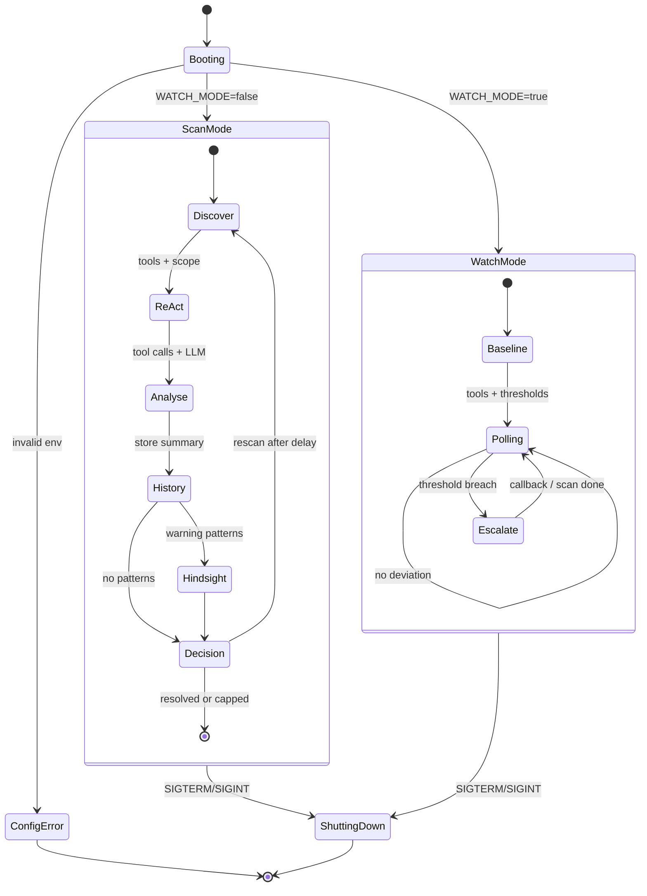

### 14.2 End-to-End Data Flow

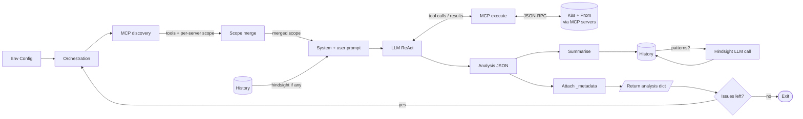
